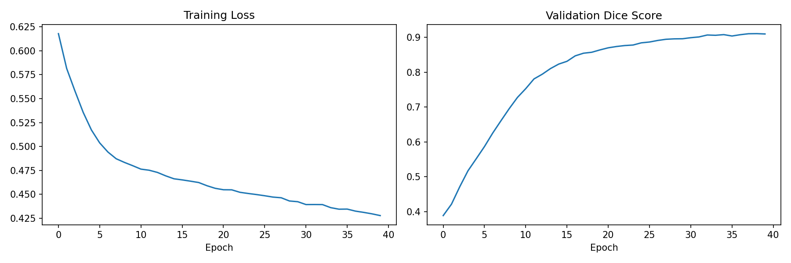
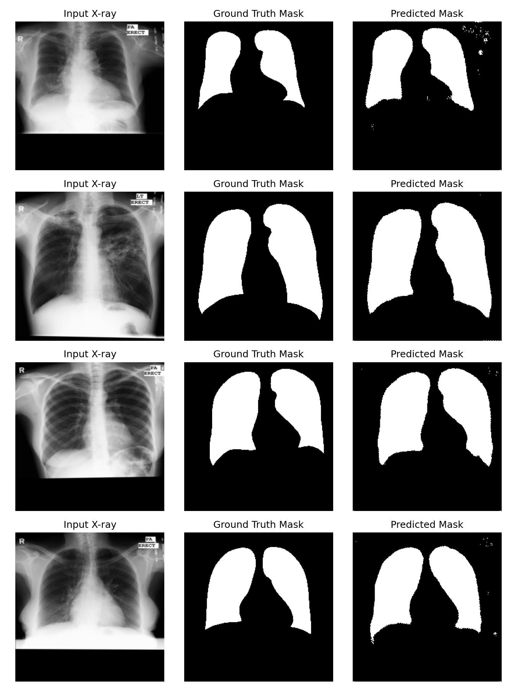

Lung_segmentation_unet
U-Net based lung segmentation on chest X-rays, built with PyTorch and MONAI. Trained on the Montgomery chest X-ray dataset, achieving 0.91 Dice score and 0.84 IoU.
Lung Segmentation using U-Net

A deep learning project for segmenting lung regions from chest X-ray images using a U-Net architecture, built with PyTorch and MONAI.

Overview

This project trains a U-Net model to automatically identify and segment lung fields in chest X-rays. Lung segmentation is a common preprocessing step in medical imaging pipelines — used before tasks like tuberculosis screening, pneumonia detection, or measuring lung shape abnormalities.

Dataset

- Source: Montgomery County chest X-ray set (National Library of Medicine)
- Size: 138 posterior-anterior chest X-rays, with manually annotated left and right lung masks
- Left and right lung masks were combined into a single binary lung mask for training
- Images resized to 256x256 for training

Model Architecture

- **U-Net** (2D), implemented via MONAI
- Encoder-decoder channels: 16 → 32 → 64 → 128 → 256
- Loss function: Dice Loss
- Optimizer: Adam, learning rate 1e-4
- Trained for 40 epochs on a single GPU (Colab GPU)

Results

| Metric | Score |
|--------|-------|
| Dice Score | 0.9106 |
| IoU | 0.8425 |

The model produces clean, accurate lung boundary predictions closely matching the ground truth masks.

Training curves

Sample predictions

Tech Stack

- Python
- PyTorch
- MONAI
- NumPy, PIL, Matplotlib

How to Run

1. Open `lung_segmentation.ipynb` in Google Colab
2. Run cells sequentially (GPU runtime recommended)
3. The dataset downloads automatically from the NLM mirror in the notebook

Notes

- Trained on a relatively small dataset (138 images), so results may vary slightly on unseen data from different sources
- Model weights (`best_lung_unet.pth`) included for reference

## Author

Aleena Kainat — AI/ML researcher working in applied deep learning and medical image analysis
